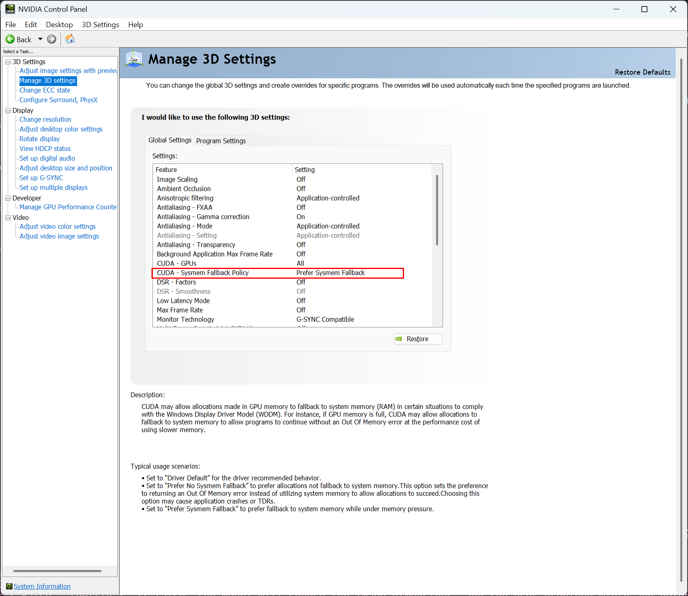
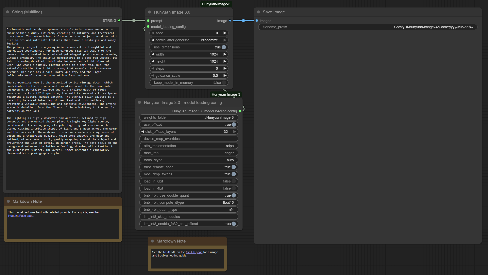

# ComfyUI Hunyuan Image 3.0 custom node

This is a custom node that allows for basic image generation using Hunyuan Image 3.0.

## Features

- Supports CPU and disk offload to allow generation on consumer setups
    - When using CPU offload, weights are stored in system RAM and transferred to the GPU as needed for processing
    - When using disk offload, weights are stored in system RAM and on disk and transferred to the GPU as needed for processing

## System Requirements

Tested (uses CPU + disk offload):
- Windows[^1]
- An Nvidia GPU with 24GB of VRAM[^1]
- 128 GB of system memory[^2]
- A PCIe 4.0 x16 connection between GPU and CPU[^3]
- An NVMe SSD[^4]

Recommended (uses CPU offload, but no disk offload)[^5]:
- Windows
- An Nvidia GPU with >32GB of VRAM
- 192GB of system memory
- A PCIe 5.0 x16 connection between GPU and CPU

Ultra (does not use offload)[^5]:
- Enough VRAM to run entirely on GPU (possibly 192GB of VRAM)

[^1]: Windows + Nvidia is required when using a GPU with low VRAM, because this combination allows for the driver to fallback to using system memory if graphics memory is full. Otherwise some operations will cause the program to crash with OOM. Graphics memory usage appears to spike above 32GB of VRAM, so system memory fallback is probably still necessary with an RTX 5090.
[^2]: The less memory you have, the more weights will have to be offloaded to disk, with a dramatic performance penalty.
[^3]: When using CPU offload, a major performance bottleneck is in copying weights across the PCIe bus to GPU.
[^4]: When using disk offload, a major bottleneck is in reading from drive, so you want it to be as fast as possible.
[^5]: This configuration has not been tested.

## Installation

1. Navigate to your custom_nodes folder
2. Clone this repo: `git clone https://github.com/bgreene2/ComfyUI-HunyuanImage3.git`
3. Change to the directory `cd ComfyUI-HunyuanImage3`
4. Assuming the correct Python environemnt is loaded, install dependencies `pip install -r requirements.txt`
5. If pytorch is not already installed, install pytorch: `pip install torch==2.7.1 torchvision==0.22.1 torchaudio==2.7.1 --index-url https://download.pytorch.org/whl/cu128`
6. Add the flag `--disable-cuda-malloc` to your ComfyUI startup script.

## Post-installation steps

- Download [the model weights](https://huggingface.co/tencent/HunyuanImage-3.0)
- If you are using an Nvidia GPU, in the Nvidia control panel, change the "CUDA Sysmem Fallback Policy" to "Prefer Sysmem Fallback"
    - 

## Usage Guide

The node has the following inputs:

- prompt - Your text prompt

The node has the following parameters:

- seed - The seed for the random number generator
- control after generate - This is attached to the 'seed' parameter
- use_dimensions - Whether to use the below user-specified width and height values. If false, the model will automatically choose the image dimensions. Note: the model has a few discrete image sizes that it supports. So even if you specify a width and height, the actual image dimensions used may be different, but should have a similar ratio.
- width - Image width
- height - Image height
- steps - Number of steps. The recommended value is 50.
- guidance_scale - CFG. The recommended value is 7.5.
- attn_implementation - Valid values are `sdpa` and `flash_attention_2`
- moe_impl - Valid values are `eager` and `flashinfer`
- weights_folder - The path to the model's weights on disk.
- use_offload - Whether to use CPU / disk offload.
- disk_offload_layers - The number of layers (out of 32) to offload to disk, rather than hold in memory. See the [Performance Tuning](#performance-tuning) section for more details.
- keep_model_in_memory - If enabled, the model will be kept in memory between generations.
- device_map_overrides - ADVANCED: You can modify the custom device_map using this. Overrides are expressed as key=value pairs, comma-separated. For example, to put layers 1 and 2 on GPU 1, you would do `model.layers.1=1,model.layers.2=1`.

Basic usage: Connect a String (Multiline) input to the `prompt` input, and connect the `Image` output to a Save Image node. An [example workflow](workflows/hunyuan_image_3_example.json) is provided.

## Performance Tuning

If you are using disk offload, you need to choose the number of layers to offload such that your RAM is not completely filled, so that the system does not use swap. This may require some trial-and-error while monitoring memory usage. On a system with 128GB of memory, 10 layers is a good starting point.

On the tested system, an image takes on the order of 1-1.5 hours to generate, using 50 steps.

## Recommended Usage

This model works best with detailed prompts. See the [HuggingFace page](https://huggingface.co/tencent/HunyuanImage-3.0) for a prompting guide. You can also use an LLM to rewrite your prompts, such as [PromptEnhancer](https://huggingface.co/PromptEnhancer/PromptEnhancer-32B).

## Troubleshooting

If you are getting crashes due to running out of GPU memory, make sure you are doing the following:

1. Use Windows
2. Use an Nvidia GPU
3. Set Sysmem Fallback Policy in the Nvidia control panel
4. Run ComfyUI with `--disable-cuda-malloc`

